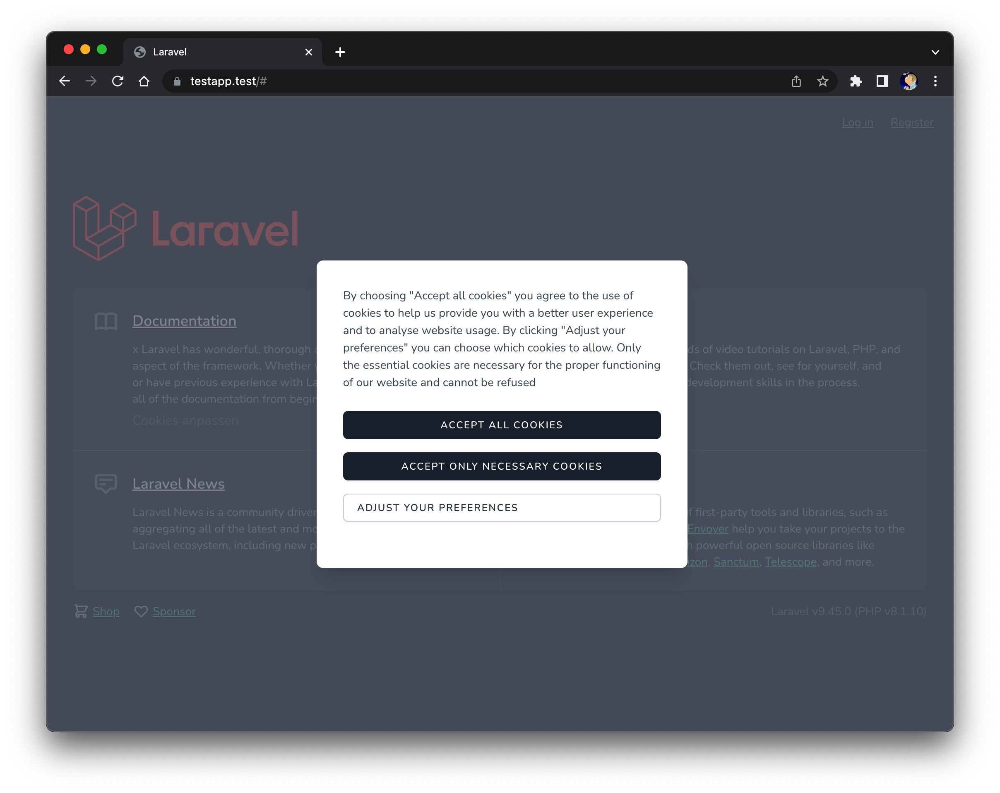
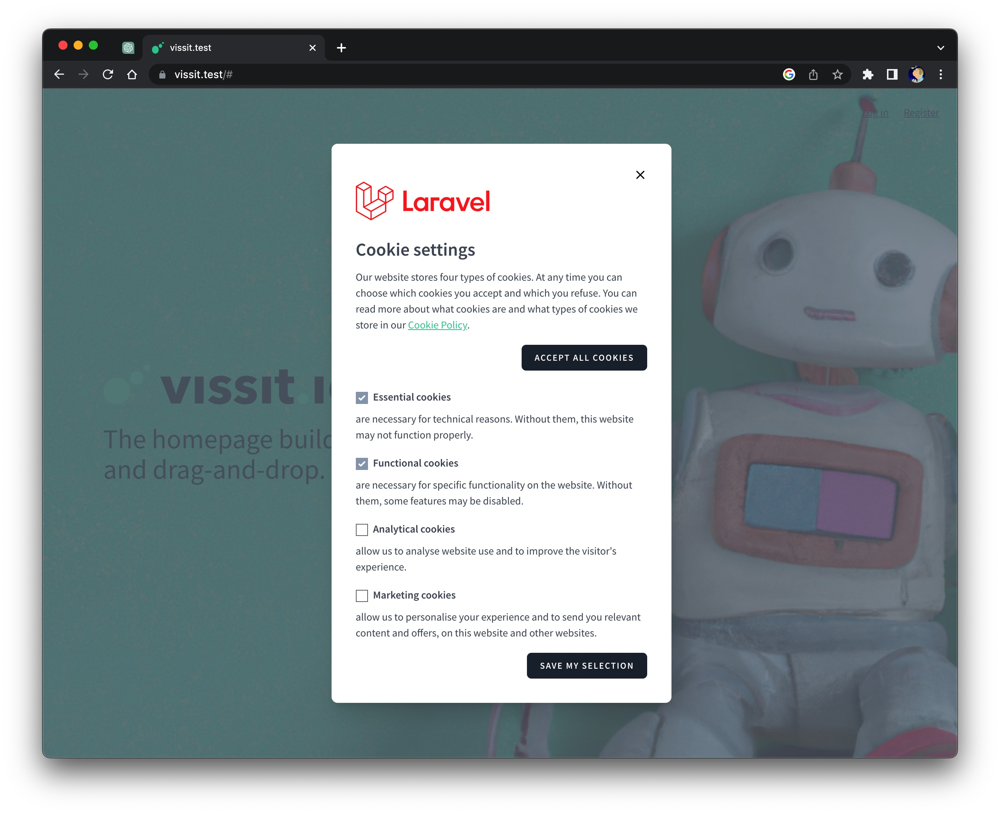

# Laravel Livewire Cookie-Consent 

[](https://packagist.org/packages/martinschenk/livewire-cookie-consent)
[](https://packagist.org/packages/martinschenk/livewire-cookie-consent)

With this package there will be set no (Google Marketing & Analytics) Cookies on your website, until the user has accepted the Cookie Policy. (Except essential and funtionality cookies). All of this, because of the crazy EU Cookie Law.






Livewire Cookie Consent is a Livewire component that provides Opt-In Cookie Modals. The user can choose between 
- Essential and functional cookies
- Analytical cookies
- Marketing cookies

Special:
- No Analytical or Marketing cookies are set before the Opt-In decision of the user (European laws).
- User can open the modal with link in page-footer to reconfigure his cookie consent selections.
- You can connect this component to Google Tag Manager if you want to. GTM example Script is included.
- You can add in your Google Tag Manager triggers for every other Cookie, you wish to control.

## Requirements

Laravel Jetstream with Livewire

Jetstream should only be installed into new Laravel applications. Attempting to install Jetstream into an existing Laravel application will result in unexpected behavior and issues

## Installation

### If you haven't installed Jetstream and Livewire

``` bash
composer require laravel/jetstream

php artisan jetstream:install livewire
```
### And now install the package

``` bash
composer require martinschenk/livewire-cookie-consent
```
Register the package in /config/app.php

```php
return [
    /*
     * Application Service Providers...
     */
    
    App\Providers\AppServiceProvider::class,
    ...
    Martinschenk\LivewireCookieConsent\CookieConsentModalServiceProvider::class,
    
];
```

## Finalizing The Installation
After installing Jetstream, you should install and build your NPM dependencies and migrate your database:

``` bash
npm install
npm run build
php artisan migrate
```


## Include Livewire and vite directives
Include this into your welcome.blade.php, landing page or any other base template you use.
```html
<html>
<head>
    ...
    @livewireStyles
    @vite(['resources/css/app.css', 'resources/js/app.js'])
</head>
<body>
    ...
    @livewireScripts
    @livewire('livewire-ui-modal')
    @include('livewire-cookie-consent::cookieconsent')
</body>
</html>
```

## Include link 
Normaly in the footer of your web-page, include this link. It will open the cookie modal to change preferences. 
```html
<a class='underline' href="#" 
   onclick="Livewire.emit('openModal', 'cookie-consent-edit')">
        {{ __('Cookie Config') }}
</a>
```

## Now it should work
Do just 
```bash
   php artisan optimize:clear
   npm run dev
```
and you should see popup the modal if you reload your webpage.

## Publishing
### Customising the dialog texts and languages

If you want to modify the text shown in the dialog you can publish the lang-files with this command:

```bash
php artisan vendor:publish --provider="Martinschenk\LivewireCookieConsent\CookieConsentModalServiceProvider" --tag="lang"
```
This will publish the f.e. english language file to lang/vendor/livewire-cookie-consent/en/texts.php . 
```php

return [
    'alert_accept' => 'Accept all cookies',
    'alert_essentials_only' => 'Accept only necessary cookies',
    'alert_settings' => 'Adjust your preferences',
    ...
];


```

### Config
Be careful changing the config values, because the Google Tag Manager is using them. Only change them if you know what you do.
```bash
php artisan vendor:publish --provider="Martinschenk\LivewireCookieConsent\CookieConsentModalServiceProvider" --tag="config"
```

This is the content of the published config-file. You'll find it in /config/livewire-cookie-consent.php


```php

return 

    'cookie_name' => 'cookie-consent',

    'cookie_value_analytics' => '2',
    'cookie_value_marketing' => '3',
    'cookie_value_both' => 'true',
    'cookie_value_none' => 'false',

    'consent_cookie_lifetime' => 60 * 24 * 365,
    'refuse_cookie_lifetime' => 60 * 24 * 30,

];


```

### Views
If you publish the views, you can edit them. The design is done with Tailwind.
You will find the views in resources/views/vendor/livewire-cookie-consent
```bash
php artisan vendor:publish --provider="Martinschenk\LivewireCookieConsent\CookieConsentModalServiceProvider" --tag="views"
```

## Configure Google Tag Manager
If you want to use Google Tag Manager, you will find an example Container script for configuration of GTM [here](./docs/GTM-Github_v16_livewire-cookie-consent.json) 

[Example Container for GTM:](./docs/GTM-Github_v16_livewire-cookie-consent.json)
```json
{
    "exportFormatVersion": 2,
    "exportTime": "2022-11-25 20:49:55",
    "containerVersion": {
        "path": "accounts/6060538801/containers/95560929/versions/16",
        "accountId": "6060538801",
        "containerId": "95560929",
        "containerVersionId": "16",
        "name": "cookie consent v1.0",
        "container": {
            "path": "accounts/6060538801/containers/95560929",
            "accountId": "6060538801",
            "containerId": "95560929",
            "name": "www.vissit.io",
            "publicId": "GTM-YOUR-CODE",
            
```

You can import or merge this GTM Container into your GTM account. Here you can find the [GTM Documentation](https://support.google.com/tagmanager/answer/6106997?hl=en-GB) for importing a Container. Its possible that you have to change the GTM-Code in the GTM Container to your own GTM-Code.

Once configured your Google Tag Manager, you have to insert the Google Tag Manager Code in the HEAD section of your website this way (between @livewireStyles and @vite...):

```html
    @livewireStyles
    HERE THE GOOGLE TAG MANAGER CODE
    @vite(['resources/css/app.css', 'resources/js/app.js'])
```

Example:

```html
<head>
    
    ...
    @livewireStyles 
    @livewireStyles 

    <!-- Google Tag Manager -->
    <script>
        window.dataLayer = window.dataLayer || [];
    </script>
    
    <script>(function(w,d,s,l,i){w[l]=w[l]||[];w[l].push({'gtm.start':
            new Date().getTime(),event:'gtm.js'});var f=d.getElementsByTagName(s)[0],
        j=d.createElement(s),dl=l!='dataLayer'?'&l='+l:'';j.async=true;j.src=
        'https://www.googletagmanager.com/gtm.js?id='+i+dl;f.parentNode.insertBefore(j,f);
    })(window,document,'script','dataLayer','GTM-YOURKEY');</script>
    <!-- End Google Tag Manager -->

    @vite(['resources/css/app.css', 'resources/js/app.js'])
</head>
```


## Security

If you discover any security related issues, please email [mschenk.pda@gmail.com](mailto:mschenk.pda@gmail.com) instead of using the issue tracker.

## Credits
This package is based on the one from spatie: https://github.com/spatie/laravel-cookie-consent and on statikbe: https://github.com/statikbe/laravel-cookie-consent

## License
The MIT License (MIT). Please see [License File](LICENSE.md) for more information.
