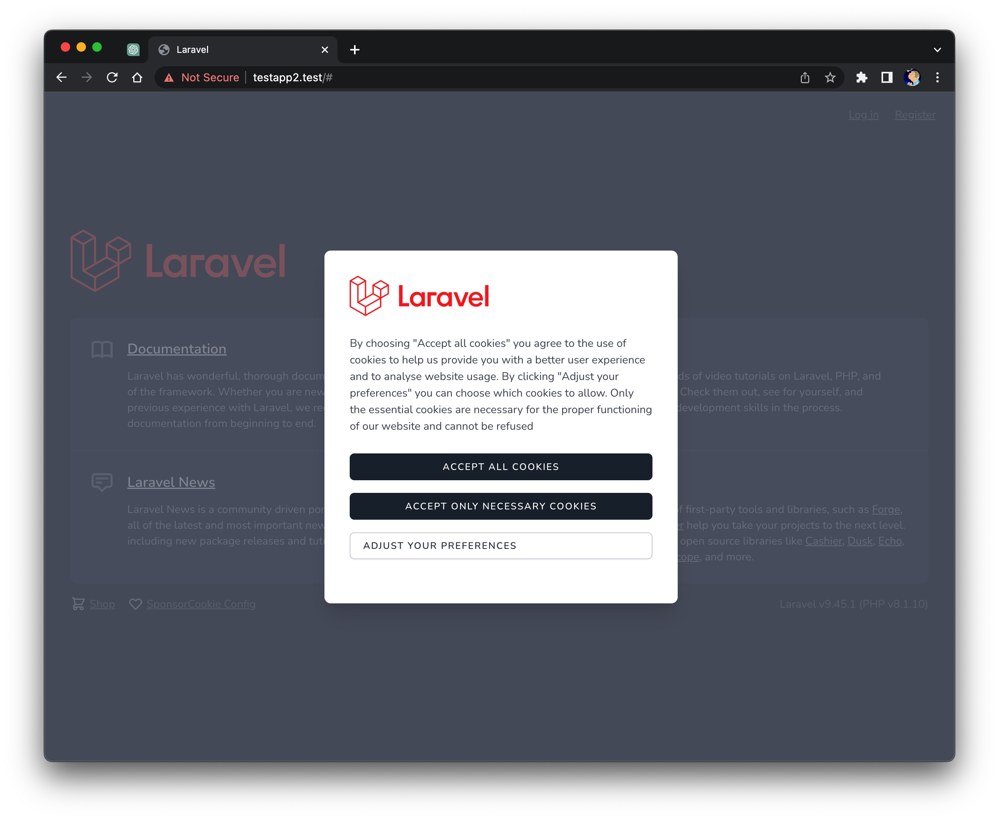
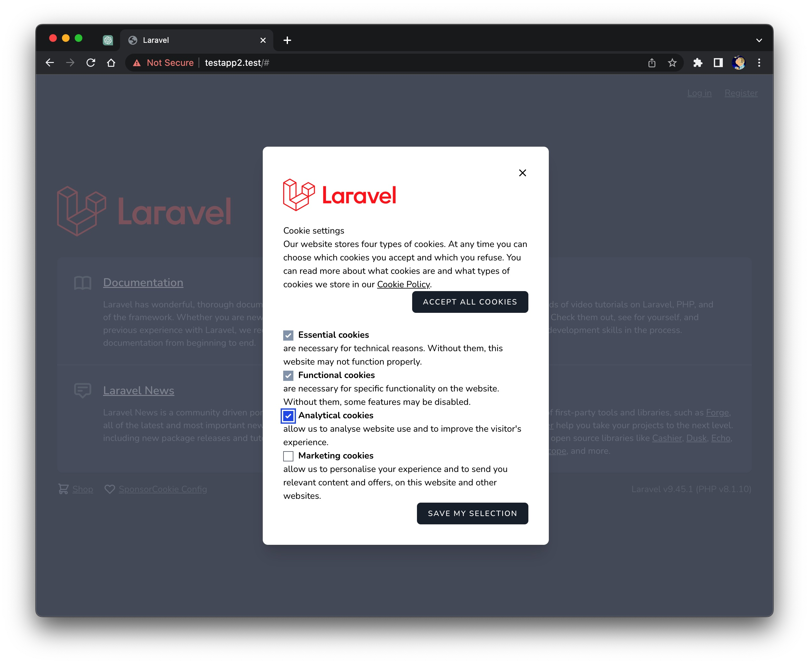

# Show a Laravel Livewire Cookie Consent Modal





The package includes script & styling for 2 modal cookie banners where the visitor can select his/her cookie preferences.

This package requires Laravel Jetstream with Livewire https://github.com/livewire/livewire, as well as https://github.com/wire-elements/modal and is based and inspired on statikbe: https://github.com/statikbe/laravel-cookie-consent.

With the difference to statikbe that it is using Livewire and a different Google Tag Manager Configuration.

## Requirements

1. PHP 7.4 or higher
2. Laravel 8.0 or higher

## Installation

You can install the package via composer:

``` bash
composer require martinschenk/livewire-cookie-consent
```
The package will automatically register itself.

## Include Livewire directives
Include this into your welcome.blade.php or any other base template you use.
```html
<html>
<head>
    ...
    @livewireStyles
</head>
<body>
    ...
    @livewireScripts
    @livewire('livewire-ui-modal')
    @include('livewire-cookie-consent::cookieconsent')
</body>
</html>
```

## Include link to open the configuration modal
Normaly in the footer of your web include this link:
```html
<a class='underline' href="#" 
   onclick="Livewire.emit('openModal', 'cookie-consent-edit')">
        {{ __('Cookie Config') }}
</a>
```

## Publishing
### Customising the dialog texts and languages

If you want to modify the text shown in the dialog you can publish the lang-files with this command:

```bash
php artisan vendor:publish --provider="Martinschenk\LivewireCookieConsent\CookieConsentModalServiceProvider" --tag="lang"
```
This will publish the f.e. english language file to lang/vendor/livewire-cookie-consent/en/texts.php . 
```php

return [
    'alert_accept' => 'Accept all cookies',
    'alert_essentials_only' => 'Accept only necessary cookies',
    'alert_settings' => 'Adjust your preferences',
    ...
];


```

### Config
Be careful changing the config values, because the Google Tag Manager is using them. Only change them if you know what you do.
```bash
php artisan vendor:publish --provider="Martinschenk\LivewireCookieConsent\CookieConsentModalServiceProvider" --tag="config"
```

This is the content of the published config-file. You'll find it in /config/livewire-cookie-consent.php


```php

return 

    'cookie_name' => 'cookie-consent',

    'cookie_value_analytics' => '2',
    'cookie_value_marketing' => '3',
    'cookie_value_both' => 'true',
    'cookie_value_none' => 'false',

    'consent_cookie_lifetime' => 60 * 24 * 365,
    'refuse_cookie_lifetime' => 60 * 24 * 30,

];


```

### Views
If you publish the views, you can edit them. The design is done with Tailwind.
You will find the views in resources/views/vendor/livewire-cookie-consent
```bash
php artisan vendor:publish --provider="Martinschenk\LivewireCookieConsent\CookieConsentModalServiceProvider" --tag="views"
```


## Security

If you discover any security related issues, please email [mschenk.pda@gmail.com](mailto:mschenk.pda@gmail.com) instead of using the issue tracker.

## License

The MIT License (MIT). Please see [License File](LICENSE.md) for more information.
